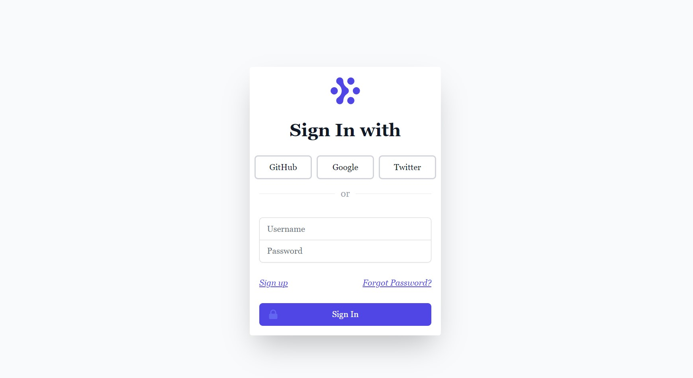

## OAUTH LOGIN SYSTEM Built with Django
### Intro ##
### This is a simple authenication app developed using Django Web Framework. After building the previous Authentication  app without social accounts I decided to build another, this time with social accounts. This mini-app can be easily integrated into a bigger system project. ###

### Features ###
* Login and Register new user.
* Login and Register new user using Social Accounts.
* Change/Reset password and email backend configured to display emails in console.
### Install Python ###
* Python 3.xx
### Install Virtualenv ###
* python3 -m venv /path/to/new/virtual/environment
### Activate Virtualenv ###
* source venv/bin/activate -- Linux Users
### Install Requirements ###
* pip install -r requirements.txt 
### Create and Populate DB ###
* python manage.py makemigrations
* python manage.py migrate
### Start Tailwind CSS ###
python manage.py tailwind start
### Runserver ###
* python manage.py runserver
